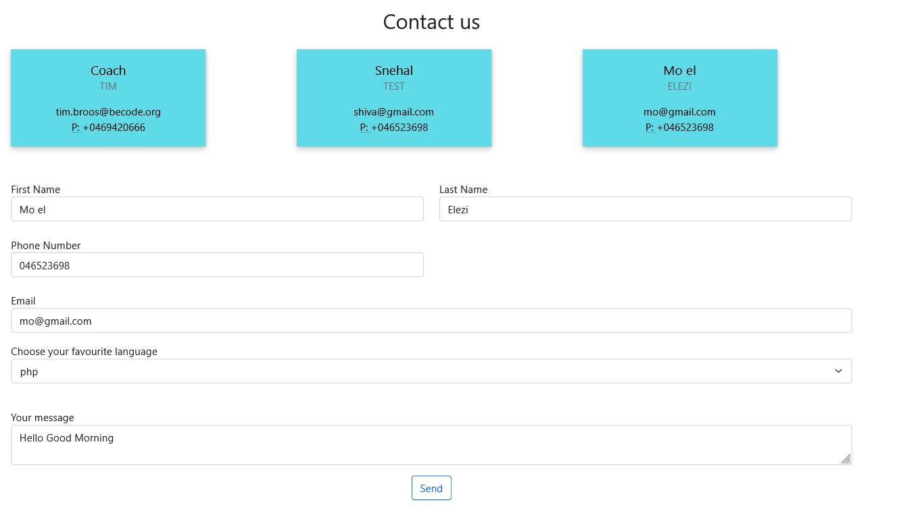

# basic-angular-form
Make an Angular application with the form and put it's data to node.js api in json format

## The Mission
You have been part of becode for quite some time, and you've made a lot of friends in the process. Make an Angular application on which your friends can fill in their data so you can have it in your node.js friendlist api.

### Must-have features

All the fields you need to put the data of your friends in your friendlist. These are:
- First name
- Last name
- Email
- Phone number
- Favourite language (html, css, js, php, ...), this will be a select with options

Error reporting, give some visual feedback to the user if they put something wrong in the inputs.

Form validation

A Friend list, do this by sending a GET request to your local node server.

A POST request to add a friend to your friend list.

### Nice-to-have features

- Make sure the email and phone number are actually emails and phone numbers.
- Make it as easy as possible for a user to add a phone number, following phone numbers could all be valid:
    - 0488888888
    - +324888 88888
    - 04 88 88 88 88
    - 0      4 8     8 8888 88
    - It's okay to only take Belgian phone numbers into account.
- Make seperate pages for adding a friend and your friend list.
- Make a "best friend" list by adding a favourite checkbox to the form
    - You can also make a seperate page for your best friends
    - You'll have to make a new app.GET function in your node server
- Add extra fields, whatever you like. Examples:
    - Profile picture
    - Signature move
    - Favourite meme
    - ...
- Think of your own new app.GET function, the possibilities are endless. Examples:
    - A list of all the people that like php
    - An amount of random friends from your list
    - A list of all the people between the age of 30 and 40
    - ...

### Steps
#### How can I run this app ?

- Currently the App is not Live on any server.
- Make sure you have prerequisites
    - Node v 16 LTS
    -  Node Package Manager
    - Angular CLI
- To run it:
    - Clone this repository
    - run npm install to get the dependencies
    - run ng serve --open To open the webapp in your browser

#### Storing submitted friend information on a server

- Create a server - Using ExpressJS here
    - mkdir server
    - cd server
    - npm init
    - npm install express
- This is a one file server, so not using the express generator.
    - Created server.js
    - Create a hello world
    - Run the server node server.js
    - Check http://localhost:6969/allFriends for server response.

### Final Output

